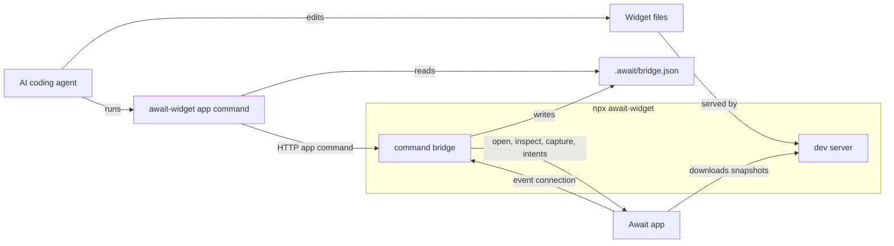

# Connection Guide

Await's computer connection lets an AI coding agent control the Await app while it edits widget files on your computer.

The computer process has two jobs:

- Serve the selected widget folder to Await for live sync.
- Write local bridge info that `await-widget app` commands use to forward app commands.

The CLI does not edit files by itself. Your agent edits files through its normal workspace access, then uses `await-widget app` to open the app, wait for previews, capture screenshots, inspect build errors, and call widget intents.

## Connection Diagram



## Project Shape

Use one npm package to manage dependencies for multiple Await widget subprojects:

```text
MyAwaitWidgets/
  package.json
  tsconfig.json
  YourWidget/
    index.tsx
  AnotherWidget/
    index.tsx
```

The widget folder you want to preview must be a first-level folder under the package root.

## Start The Computer Bridge

From the widget folder you want to sync, start the computer bridge:

```sh
cd YourWidget
npx await-widget
```

The command serves that single widget folder and prints a URL for Await. Use the primary URL shown in the terminal.

It also writes `.await/bridge.json` in the package root. App commands read that file to find the local bridge URL.

## Connect Await

1. Open the matching widget detail page in Await.
2. Choose `Connect Computer` from the detail menu.
3. Paste the URL from the terminal.

After sync starts, the app keeps an event connection to the computer bridge. When the widget folder changes, Await checks the version, downloads the changed snapshot, rebuilds the widget, and refreshes the app preview and Home Screen widget.

## Run App Commands

Run app commands from the package root, widget folder, or any subfolder under the package:

```sh
npx await-widget app open-syncing-widget-detail
npx await-widget app wait-for-widget-ready --widget-id 2
npx await-widget app capture-current-preview --widget-id 2
```

Commands read `.await/bridge.json` from the nearest package root. Pass `--workspace /path/to/package-or-widget` when running from another directory.

Run `npx await-widget --help` to see the current app command list, descriptions, internal tool names, and input schemas.

## Agent Loop

A typical agent workflow is:

1. Edit widget files in the local workspace.
2. Run `npx await-widget app open-syncing-widget-detail` to bring the connected widget detail page forward in Await.
3. Run `npx await-widget app wait-for-widget-ready --widget-id <id>` after a sync or preview mode change.
4. Run `npx await-widget app get-build-errors --widget-id <id>` when the preview does not look right.
5. Run `npx await-widget app set-preview-mode --mode small --widget-id <id>` to inspect small, medium, large, or extra large layouts.
6. Run `npx await-widget app capture-current-preview --widget-id <id>` to review the rendered widget image.

Useful app commands include:

- `list-app-widgets`
- `open-widget-detail --widget-id <id>`
- `open-syncing-widget-detail`
- `set-preview-mode --mode <small|medium|large|extraLarge> [--widget-id <id>]`
- `capture-current-preview [--widget-id <id>]`
- `get-widget-status --widget-id <id>`
- `wait-for-widget-ready --widget-id <id> [--timeout-ms <ms>]`
- `get-build-errors --widget-id <id>`
- `list-widget-intents --widget-id <id>`
- `call-widget-intent --widget-id <id> --intent-id <id> [--input <json-array>]`

## Sync Behavior

- The connected computer widget folder is the source of truth.
- Sync is one-to-one: one computer widget folder to one Await widget.
- Sync directly replaces the connected widget directory in Await.
- It does not merge files, preserve old widget files, resolve conflicts, or create a copy.
- SQLite and `AwaitStore` data are not deleted.
- `node_modules`, `.git`, `.build`, `dist`, `build`, and hidden files are not synced.

## Stopping And Switching

- Stop the computer bridge with `Ctrl+C` in the terminal.
- Leaving a widget detail page does not stop sync.
- Connecting another widget detail page replaces the previous sync.
- When Await enters the background, the event connection pauses.
- When Await returns to the foreground, the event connection resumes and Await checks active bindings once in case it missed changes.
- If Await is fully closed or killed by the system, the old connection is not restored. Connect again from the widget detail page.
- Use `Disconnect Computer` in the connected widget detail menu to stop sync from the app.
